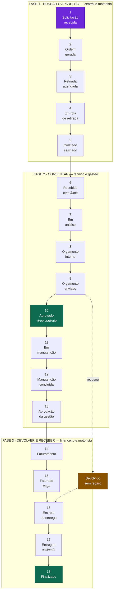
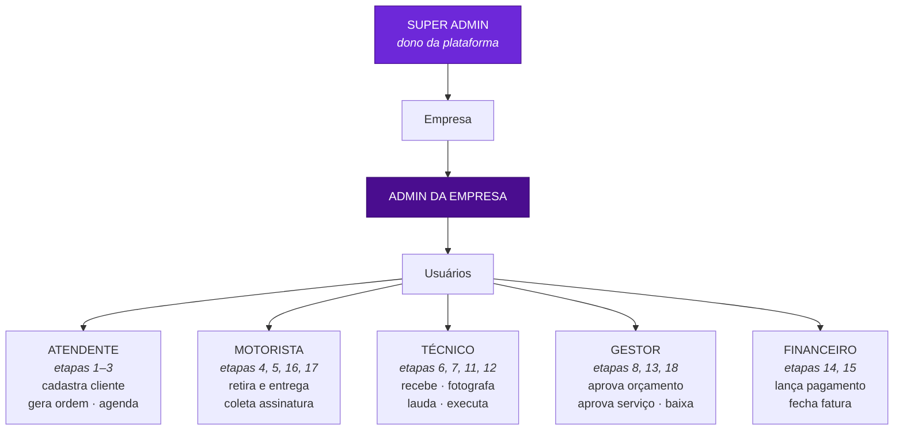
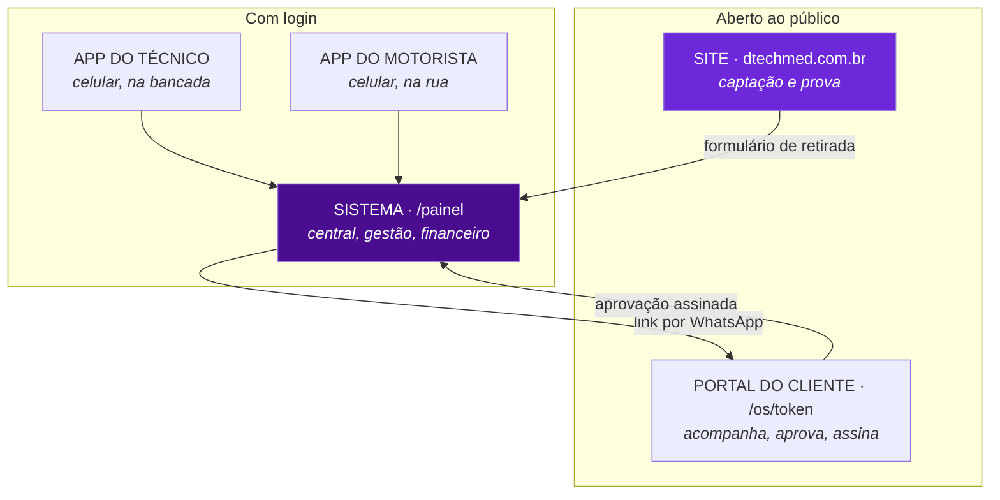
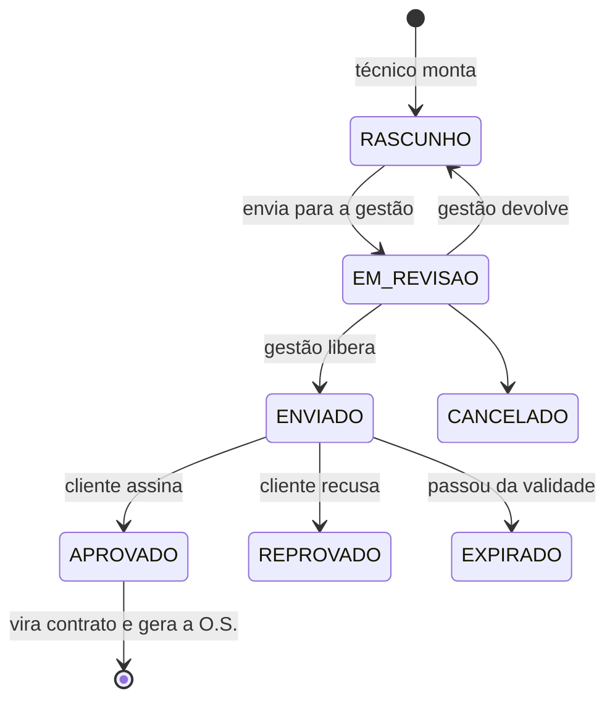
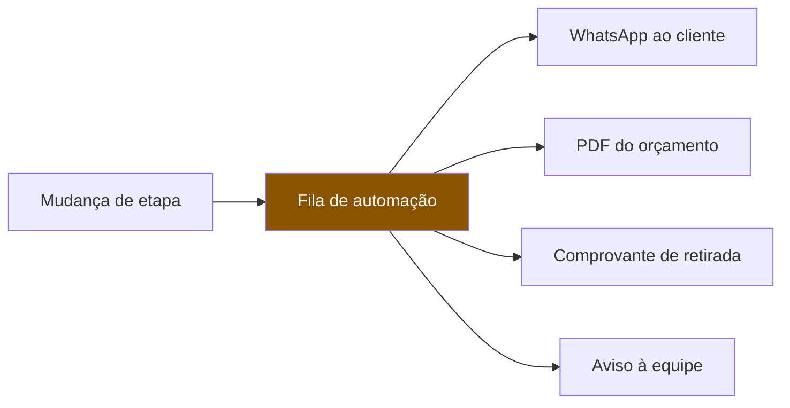
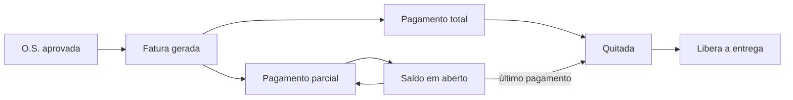
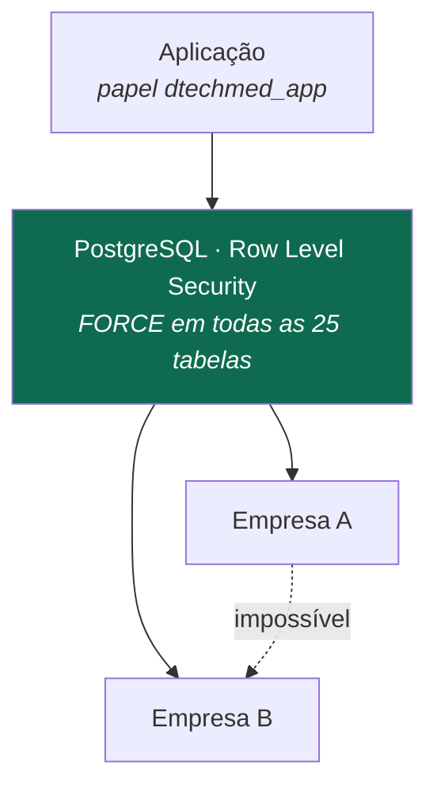

<title>Processos DTECH MED</title>

# Como o sistema funciona, passo a passo

Tirado da máquina de estados do código, não de memória. Se um dia divergir, o código é que está certo — e este arquivo é que precisa ser corrigido.

---

## 1. A esteira: 18 etapas, 11 passos, 3 fases

É o órgão vital. Todo equipamento que entra percorre esta linha, e cada passagem de etapa fica registrada com **quem fez**, **quando** e **de onde** — é isso que vira o prontuário que o cliente lê.

O mesmo caminho é contado em três alturas, e cada uma serve a uma pergunta:

| Contagem | Onde mora | Para que serve |
| --- | --- | --- |
| **18 etapas** | `maquina-estados.ts` | São as **travas**. Cada uma confere assinatura, foto, orçamento ou pagamento antes de deixar a ordem andar. É o que valida. |
| **11 passos** | `roteiro.ts` | É o **dia**. É como o dono conta o trabalho em voz alta ao telefone. |
| **3 fases** | `fases.ts` | É a **tela**. É o que a pessoa vê antes de ler qualquer coisa. |

Agrupar é desenho, nunca permissão: ninguém pula uma trava porque seis quadradinhos viraram um botão.

**A fase é o lugar do aparelho no mundo**, e é por isso que o corte é aí: na fase 1 ele está com o cliente ou na rua; na 2 está na bancada; na 3 já está consertado e o que falta é dinheiro e estrada. Trocar de fase é o equipamento mudar de lugar — dá para dizer em que fase uma ordem está sem abrir nada.

**Uma cor nunca conta a história sozinha.** Verde (pronta), laranja (acontecendo agora) e vermelho (ainda não começou) são a leitura de longe; ao lado de cada uma vai um selo desenhado (✓ ● ○ !) e a situação escrita. Cerca de um homem em cada doze não separa verde de vermelho, e um sistema que só diz "está verde" está mandando essa pessoa adivinhar.

**A trava da fase é de olho, não de mão.** Uma fase adiante pode ser aberta e lida — conferir o que vem depois não faz mal a ninguém. O que ela não tem é botão que ande a esteira, porque quem impede a fase 2 de começar antes da 1 é a máquina de estados, e não a tela.

**Ramos alternativos**, que existem porque a vida real tem: `Orçamento reprovado` → o aparelho volta sem conserto. `Cancelado` → a ordem é encerrada antes do fim. Nenhum dos dois apaga o histórico; eles são mais uma etapa registrada.

---

## 2. Quem faz o quê

O papel decide **o que aparece na tela** e **o que a pessoa pode fazer**. As duas coisas são conferidas separadamente: esconder o botão é conforto, quem autoriza de verdade é a trava na ação e a política no banco.

---

## 3. As quatro faces do mesmo sistema

O portal do cliente **não pede senha**: o link que chega no WhatsApp carrega um token longo que faz o papel de chave. Por isso ele é bloqueado no `robots.txt` e marcado como não-indexável — link de ordem de serviço no Google seria o prontuário de uma clínica achável por qualquer pessoa.

---

## 4. O orçamento, do rascunho ao contrato

A assinatura do cliente no portal é o que transforma orçamento em contrato. Ela é guardada com o CPF/CNPJ conferido, o horário e o endereço de onde veio.

---

## 5. O que dispara sozinho

Nada disso acontece dentro do clique de quem está usando o sistema: entra numa fila e um processo separado executa. É o que impede a geração de um PDF de travar a tela de quem está atendendo — e o que permite tentar de novo quando o WhatsApp está fora do ar.

> ⚠️ **Hoje esta parte está parada.** O `UAZAPI_ADMIN_TOKEN` está vazio, então não há número de WhatsApp conectado. A fila funciona e acumula; ela só não tem para onde entregar. Enquanto isso, o cliente não recebe o link da ordem, nem o orçamento, nem aviso de etapa.

---

## 6. O dinheiro

A fatura aceita **pagamento fracionado**: várias baixas parciais até quitar. A entrega só é liberada com a fatura quitada — é a trava que impede o equipamento de sair sem o pagamento fechado.

---

## 7. O isolamento entre empresas

O sistema é multiempresa e vai virar franquia. O isolamento não depende do código lembrar de filtrar:

O papel que serve a aplicação **não é superusuário e não ignora RLS**. Uma consulta sem filtro devolve zero linhas em vez de devolver tudo. Cada `subir.sh` confere isso e recusa o deploy se alguma tabela estiver frouxa.
